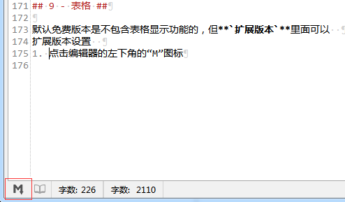

# **MarkDown**语法 详解 #
****************************

##1 - 标题##
#一级标题#
##二级标题##
###三级标题###
####四级标题####
#####五级标题#####
######六级标题######

一级标题
=
二级标题
-

#这是一级标题
##这是二级标题
###这是三级标题
####这是四级标题
#####这是五级标题
######这是六级标题

****************************

##2 - 字体设置斜体、粗体、删除线##
正常文字

*这是倾斜文字*

_这也是倾斜文字_

**这是加粗文字**

***这是倾斜加粗文字***

~~这是下划线文字-----这个不正确~~

****************************

##3 - 段落##

- 段落的前后要有空行，所谓的空行是指没有文字内容，
若想在段内强制换行的方式是
使用两个以上空格加上回车（引用中换行省略回车)
 


- 换行：  
方法1: 连续两个以上空格+回车  
方法2：键入 html 语言换行标签：<br>

- 段首缩进：  
使用特殊占位符，不同占位符所占空白是不一样大的。  
&ensp;  表示一个半角的空格  
&#8194;  也表示一个半角的空格 
 
&emsp; 	表示一个全角的空格   
&#8195;  也表示一个全角的空格  

&emsp;&emsp;  两个全角的空格（用的比较多）  

&nbsp;  不断行的空白格  
&#160;  也表示不断行的空白格  

****************************

##4 - 区块引用##
> 区块引用
> > 嵌套引用
> > >三嵌套引用
> > > > 四嵌套引用

> 不连续引用  
> 文字  
> 文字  
> 文字  
> 
> 文字

> 连续引用  
> 文字  
> 文字  
> 文字  

****************************

## 5- 文本强调 ##

*文本斜体强调*，_文本斜体强调_

**文本加粗强调**，__文本加粗强调__

****************************

## 6 - 分割线 ##

***
---
___

你可以在一行中用三个以上的星号(*)、减号(-)、底线(_)来建立一个分隔线，行内不能有其他东西。你也可以在星号或是减号中间插入空格。

****************************

## 7 - 代码区块 ##

1、 代码块：缩进 4 个空格或是 1 个制表符。

   注意⚠️：需要和普通段落之间存在空行！

	#include <stdio.h>
	int main(void) {
		printf("Hello world\n");
	}
	
2、行内式：如果在一个行内需要引用代码，只要用反引号`引起来就好。

这是一个行内式引用代码示例，调用头文件`#include <stdio.h>`

3、  
	```
	#include <stdio.h>
	int main(void) {
		printf("Hello world\n");
	}
	```

****************************

## 8 - 列表 ##

>无序列表  
无序列表用 - + * 任何一种都可以  
注意：- + * 跟内容之间都要有一个空格  

+ 无序连表无 
* 无序列表  
- 无序列表  

>有序列表  
使用数字和一个英文句点表示有序列表。  
注意：英文句点后面一定要有一个空格，起到缩进的作用。  

1. 有序列表
3. 有序列表
7. 有序列表
9. 有序列表  

>混合使用 列表嵌套  
>上一级和下一级之间敲三个空格即可

1. 一级有序列表
   + 二级无序列表
      1. 三级有序列表
      2. 三级有序列表
   + 二级无序列表

2. 有序列表  
   1.  二级有序列表
      +  三级无序列表
   2.  二级有序列表
      +  三级无序列表

3. 一级有序列表  
	3.1 有序列表  
	3.2 有序列表

****************************

## 9 - 表格 ##

>默认免费版本是不包含表格显示功能的，但**`扩展版本`**里面可以  
扩展版本设置  

1. 点击编辑器的左下角的“M”图标  

2. 选择Markdown(Extra)模式  

语法说明：

- 第一行为表头，第二行分隔表头和主体部分，第三行开始每一行为一个表格行；
- 列于列之间用管道符 | 隔开。原生方式的表格每一行的两边也要有管道符；
- 第二行还可以为不同的列指定对齐方向。默认为左对齐，可以使用冒号 : 来定义表格的对齐方式。冒号在分隔符 - 右边右对齐，在两边居中。

>表格示例：  

- 简单方式写表格  

姓名|性别|分数
-|-|-
小明|男|90
小红|女|89
张小胖|男|65  

姓名|性别|分数
:-:|:-:|:-:
小明|男|90
小红|女|89
张小胖|男|65  

- 原生方式写表格：  
  
|姓名|性别|分数|
|-|-|-|
|小明|男|68|
|小红|女|87|
|张小胖|男|67|

****************************

## 10 - 链接 ##

语法：
[超链接名](超链接地址 "超链接title")

- 行内式  
[NarkDown语法详解](https://github.com/liangzhijun1314/2019_exploit/blob/master/word/Markdown%E8%AF%AD%E6%B3%95/MarkDown%E8%AF%AD%E6%B3%95%E8%AF%A6%E8%A7%A3.md)  
- 参考式  
NarkDown语法详解  <https://github.com/liangzhijun1314/2019_exploit/blob/master/word/Markdown%E8%AF%AD%E6%B3%95/MarkDown%E8%AF%AD%E6%B3%95%E8%AF%A6%E8%A7%A3.md>

****************************

## 11 - 图片 ##

语法：  
  
1. 图片alt就是显示在图片下面的文字，相当于对图片内容的解释。  
2. 图片title是图片的标题，当鼠标移到图片上时显示的内容。title可加可不加  
3. 使用相对路径插入图片。比如你把一个叫做1.png的图片和*.md文件放在一起，那么你就可以用这种方式插入图片：  
4. 如果不想放在同一层级,那么就可以这样插入: 表示引用同层级一个叫做”foldername”的文件夹中的1.png图片,以此类推  
   
- 行内式：网络图片  

  


- 行内式：本地图片


****************************

## 12 - 特殊符号 ##

1. 对于 Markdown 中的语法符号，前面加反斜线\即可显示符号本身。  
\\ 反斜杠  
\* 星号  
\_ 下划线  
\{\} \[\] \(\)括号  
\# 井号  
\+ 加号  

2. 其他特殊字符，示例如下：  
&#10084;  
&#10003;  
&#9728;  
&#9733;  
&#9730;  
&#9775;  
&#8634;  

想知道字符对应的Unicode码，可以看这个网站：<https://unicode-table.com/cn/>
